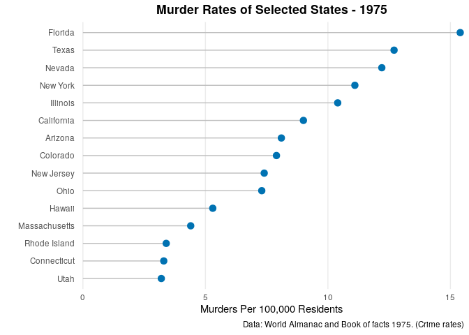
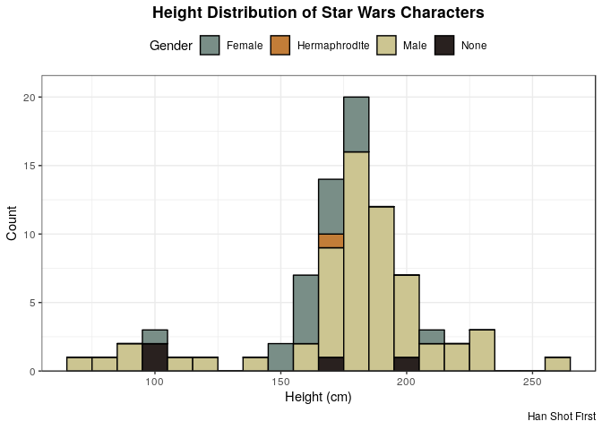
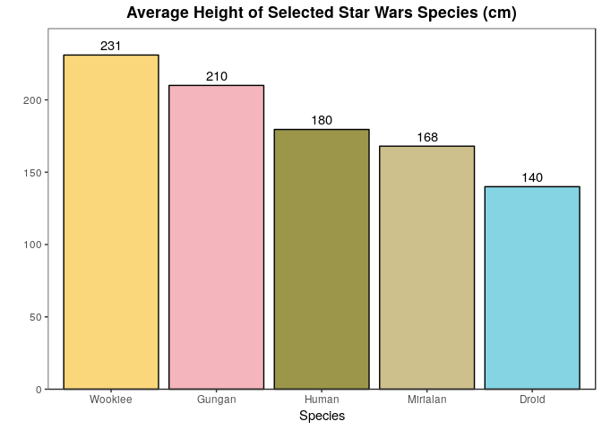
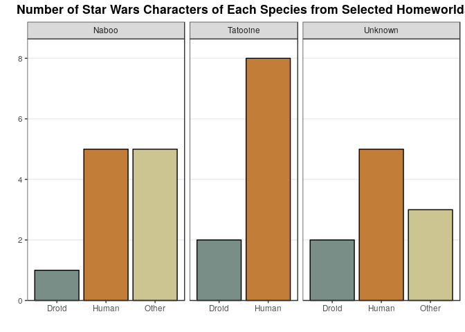
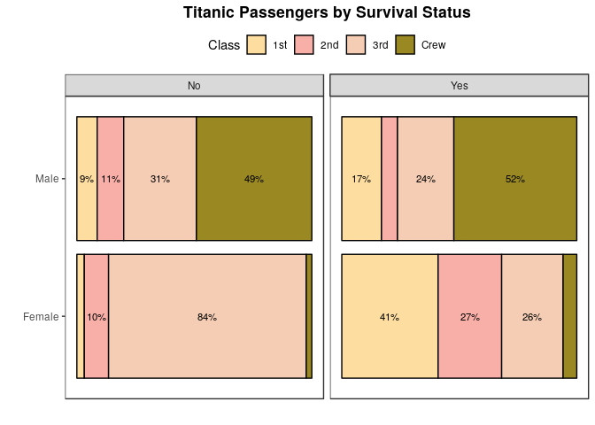
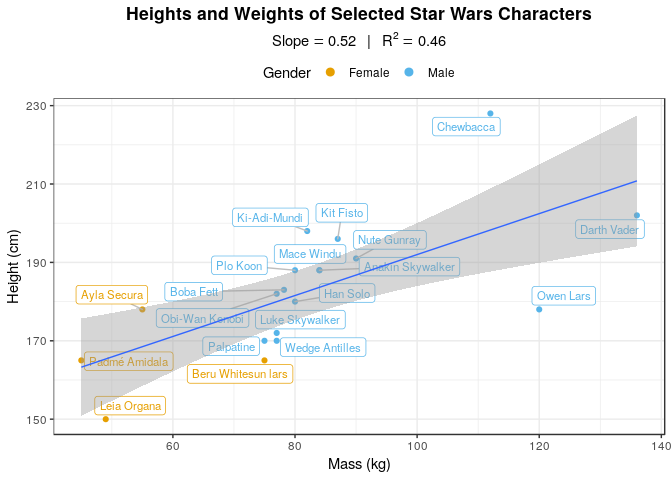
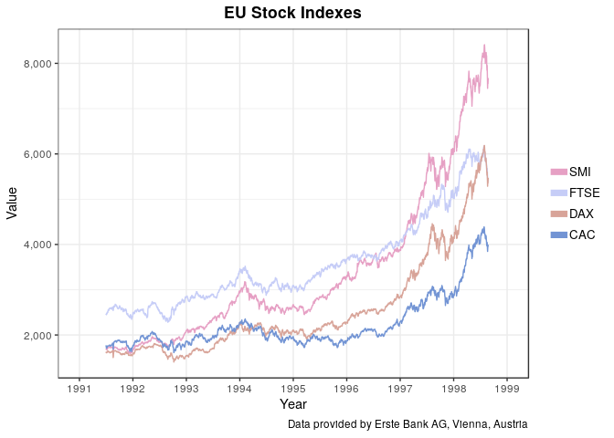
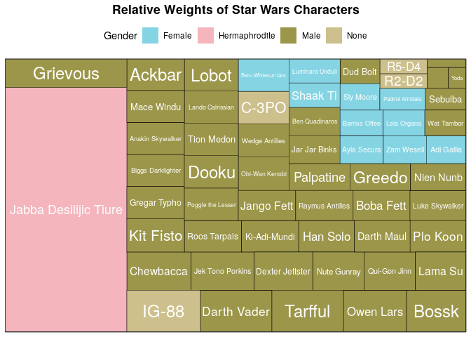

Chart Collection
================
Jesse Cambon
13 August, 2018

-   [Data Preparation](#data-preparation)
-   [Chart Types](#chart-types)
    -   [Lollipop](#lollipop)
    -   [Waffle](#waffle)
    -   [Histogram](#histogram)
    -   [Bar](#bar)
    -   [Scatter](#scatter)
    -   [Line](#line)
    -   [Stacked Area](#stacked-area)
    -   [Treemap](#treemap)

This notebook contains code for producing a variety of charts with ggplot. The charts are for demonstration purposes and are not necessarily meant to represent best practices.

Notes: Use 'fill' commands for areas and 'color' for lines. To save any plot use ggsave()

Data Preparation
================

``` r
# Load libraries - you will need to install these with install.packages('packagename')
# if you do not have them installed
library(tidyverse)
library(ggrepel) # loads ggplot2 as well
library(treemapify) # ggplot treemap
#library(knitr)
library(treemap)
library(formattable) # percent format
library(wesanderson) # Color Palettes from Wes Anderson Movies
library(waffle) # waffle charts, make sure to install the github version with devtools::install_github("hrbrmstr/waffle")
library(lubridate) # time/date related functions


# Color blind friendly palette from http://www.cookbook-r.com/Graphs/Colors_(ggplot2)/
cbPalette <- c("#999999", "#E69F00", "#56B4E9", "#009E73", "#F0E442", "#0072B2", 
               "#D55E00", "#CC79A7")

film_chron_order = c("The Phantom Menace", "Attack of the Clones", "Revenge of the Sith",
  "A New Hope","The Empire Strikes Back", "Return of the Jedi","The Force Awakens")  

# Set default ggplot theme
theme_set(theme_bw()+
  theme(legend.position = "top",
            plot.subtitle= element_text(face="bold",hjust=0.5),
            plot.title = element_text(lineheight=1, face="bold",hjust = 0.5)))

data(Titanic)
titanic <- Titanic %>% as_tibble() 


titanic_bar <- titanic %>%
  # add a percent for Class 
  group_by(Sex,Survived,Class) %>%
  summarize(n=sum(n)) %>%
  group_by(Sex,Survived) %>%
  mutate(percent_num=n/sum(n),percent_char=as.character(percent(n/sum(n),0)))

# Titanic passenger composition (for waffle chart)
titanic_class <- titanic %>%
  group_by(Class) %>%
  summarize(n=sum(n)) %>%
  ungroup()

# Average height and weight by species
starwars_jac <- starwars %>% group_by(name) %>%
  mutate(num_films=length(unlist(films)),
         height_to_mass_ratio = height / mass,
           # bucket species
  species_collapsed=case_when(
    !(species %in% c('Human','Droid')) ~ 'Other',
    TRUE ~ species
  )) %>%
  ungroup() 

# put each film on a different row
# ie. character-film level dataset
starwars_unnest <- starwars_jac %>%
  unnest(films) %>%
  mutate(films= factor(films,levels=film_chron_order)) %>%
  mutate(episode=as.integer(films)) %>%
  rename(film=films)

# Number of characters of each species by film
starwars_species_film <- starwars_unnest %>% 
  count(episode,species_collapsed) %>% drop_na() 

# % of characters in each film by gender
starwars_gender_film <- starwars_unnest %>%
  count(episode,gender) %>% drop_na() %>% 
  group_by(episode) %>% 
  mutate(prop=n/sum(n)) %>%
  ungroup() 

species_summ <- starwars_jac %>% group_by(species) %>%
  drop_na(c(height,mass)) %>%
  summarise(average_height=mean(height),
            average_mass=mean(mass),
            count=sum(n())) %>% ungroup() %>%
  mutate(height_to_mass_ratio = average_height / average_mass) %>%
  filter(count!=1) # don't look at species that only have one member

# Display in table
#kable(species_summ)

homeworld_summ <- starwars_jac %>%
  count(homeworld,species_collapsed) %>%
  group_by(homeworld) %>%
  mutate(homeworld_pop=sum(n)) %>%
  ungroup() %>%
  # If homeworld is missing, label it unknown
  replace_na(list(homeworld='Unknown')) %>%
  arrange(desc(n)) %>%
  filter(homeworld_pop > 3)

## Drop missing height and weight values for scatter plot
# Also drop Jabba and Yoda because they are outliers
starwars_ht_wt <- starwars_jac %>% drop_na(c(height,mass,gender)) %>%
  filter(!str_detect(name,'Jabba|Yoda')) %>% 
  filter(num_films >= 3)

murder_rates <- USArrests %>% 
  rownames_to_column('State') %>%
  as_tibble() %>%
  arrange(desc(UrbanPop)) %>%
  head(15) %>%
  arrange(desc(Murder)) %>% 
  mutate(State=factor(State,levels=rev(State)))

eu_stock <- EuStockMarkets %>% 
  as_tibble() %>%
  gather(Index,Price) %>%
  mutate(Year=rep(time(EuStockMarkets),4)) 
```

Chart Types
===========

Lollipop
--------

``` r
  ggplot(data=murder_rates, aes(x=State, y=Murder) ) +
    geom_segment( aes(x=State ,xend=State, y=0, yend=Murder), color="grey") +
    geom_point(size=3, color=cbPalette[6]) +
   theme_minimal() +
  theme(    plot.subtitle= element_text(face="bold",hjust=0.5),
            plot.title = element_text(lineheight=1, face="bold",hjust = 0.5),
      panel.grid.minor.y = element_blank(),
      panel.grid.major.y = element_blank(),
      panel.grid.minor.x = element_blank(),
      legend.position="none"
    ) +
  coord_flip() +
    # expand gets rid of space between labels stem of lollipops
    scale_y_continuous(expand = c(0, .15)) + 
    labs(title='Murder Rates of Selected States - 1975',
        caption='Data: World Almanac and Book of facts 1975. (Crime rates)') +
    xlab("") +
    ylab('Murders Per 100,000 Residents')
```



Waffle
------

``` r
waffle_palette <- wes_palette('Darjeeling2')
waffle_palette[5] <- 'white' # 

waffle( titanic_class %>% 
    rename(names=Class,vals=n),  # rename data to match waffle chart syntax
  rows = 30, size = 0.5, 
  colors = waffle_palette, legend_pos = "bottom") +
  labs(title='Titanic Passengers by Class') +
  theme(plot.title = element_text(lineheight=1, face="bold",hjust = 0.5,size=14)) +
  guides(fill = guide_legend(title='Class'))
```


Histogram
---------

``` r
# Histogram with autobinning based on gender
ggplot(starwars_jac %>% replace_na(list(gender='none')), aes(height)) + scale_fill_manual(values = wes_palette('Moonrise2')) +
  geom_histogram(aes(fill=gender), 
                   binwidth = 10, 
                   col="black") +
            #       size=.1) +  # change binwidth
  labs(title="Height Distribution of Star Wars Characters", 
       caption="Han Shot First") +
xlab('Height (cm)') +
ylab('Count')
```

    ## Warning: Removed 6 rows containing non-finite values (stat_bin).



Bar
---

``` r
# A simple bar chart - average heights of the species
# the reorder command orders our bars in order of descending height
ggplot(data=species_summ,
          aes(x = reorder(species,-average_height), y=average_height, fill = species)) +
geom_bar(stat='identity',position='dodge') +
scale_fill_manual(values=wes_palette('Moonrise3')) +
geom_text(aes(label=round(average_height)), vjust=-0.25) +
theme(legend.position="none",
      panel.grid.minor.x = element_blank(),
      panel.grid.major.x = element_blank(),
      panel.grid.minor.y = element_blank(),
      panel.grid.major.y = element_blank()) +
labs(title='Average Height of Selected Star Wars Species (cm)') +
xlab('Species') +
ylab('')
```



``` r
# Take a look at number of each species from each homeworld
ggplot(data=homeworld_summ,
          aes(x = species_collapsed, y=n,fill = species_collapsed)) +
# The scales argument suppress the presense of an empty "Other" species
# slot on Tatooine
facet_grid(~homeworld,scales = 'free',space='free') +
geom_bar(stat='identity') +
scale_fill_manual(values=wes_palette('Moonrise2')) +
theme(legend.position="none",legend.title=element_blank(),
      panel.grid.minor.x = element_blank(),
      panel.grid.major.x = element_blank(),
      panel.grid.minor.y = element_blank()) +
labs(title='Number of Characters of Each Species from Selected Homeworlds') +
xlab('') +
ylab('')
```



``` r
# Stacked bar of Titanic dataset

ggplot(data=titanic_bar,
          aes(x = Sex, y=percent_num,fill = fct_rev(Class))) +
facet_grid(~Survived) +
geom_bar(stat='identity') +
coord_flip() +
  geom_text(data=titanic_bar,aes(label = ifelse(percent_num > 0.07 ,percent_char,NA)),
    size = 3,position = position_stack(vjust = 0.5)) +
scale_fill_manual(values=wes_palette('Royal2')) +
theme(axis.text.x=element_blank(),
        axis.ticks.x=element_blank(),
      panel.grid.minor.x = element_blank(),
      panel.grid.major.x = element_blank(),
      panel.grid.major.y = element_blank())+
labs(title='Titanic Passengers by Survival Status') +
xlab('') +
ylab('') +
guides(fill = guide_legend(title='Class',reverse=T))
```

    ## Warning: Removed 4 rows containing missing values (geom_text).



Scatter
-------

``` r
# Linear model
fit <- lm(height ~ mass, data=starwars_ht_wt)
coeff <- as.numeric(fit$coefficients[2])
r_square <- summary(fit)$r.squared

# Scatter plot of heights and weights 
# Note - group=1 is set in ggplot aes to force geom_smooth to fit
# both groups
ggplot(data=starwars_ht_wt,
          aes(x = mass, y = height, color = gender,group=1)) +
geom_point() +
theme(legend.title=element_blank(),
      legend.margin=margin(0,0,0,0)) +
geom_label_repel(
    data = starwars_ht_wt,
    aes(label = name),
    size = 3,
    force = 5,
    box.padding = 0.2, # use this to control label spacing
    segment.color = 'grey',
    show.legend = F # need this to fix legend
  ) +
geom_smooth(method="lm",show.legend=F,size=0.5) +
scale_color_manual(values=c(cbPalette[2:3])) +
labs(title='Heights and Weights of Selected Star Wars Characters',
     subtitle = bquote(Slope == .(round(coeff,2)) ~ ' | ' ~ R^2  ==  .(round(r_square,2)) )) +
       
      # str_c('Slope: ',as.character(round(coeff,2)),'  |  ',
      #                expression(paste("R"^"2")),as.character(round(r_square,2)))) +
xlab('Mass (kg)') +
ylab('Height (cm)')
```



``` r
# Create interactive data table of raw data
# This only works in HTML format so comment it out if knitting to github format 
#datatable(starwars %>% select(-hair_color,skin_color,-birth_year), options = list(pageLength = 10))
```

Line
----

``` r
# Horizontal axis limits (Year)
eu_plot_lims <- c(round(min(eu_stock$Year)),round(max(eu_stock$Year)))

# Performance of EU Stock Indexes
ggplot(eu_stock,
          aes(x=Year,y=Price,color = fct_rev(Index))) +
geom_line() +
scale_x_continuous(limits=eu_plot_lims,breaks=eu_plot_lims[1]:eu_plot_lims[2]) +
scale_y_continuous(labels=scales::comma) + 
scale_color_manual(values=wes_palette('GrandBudapest2')) +
labs(title='EU Stock Indexes',
     caption='Data provided by Erste Bank AG, Vienna, Austria') +
theme(legend.title = element_blank(),
      panel.grid.minor.x = element_blank(),
      legend.text=element_text(size=10),
      legend.position='right') +
xlab('Year') +
ylab('Price') +
# make legend lines bigger
guides(colour = guide_legend(override.aes = list(size=2.5))) 
```



``` r
# Number of characters from each species 
ggplot(data=starwars_gender_film,
          aes(x = episode, y=prop,color = gender)) +
geom_line() + geom_point() +
scale_x_continuous(breaks=c(1:7)) +
scale_y_continuous(labels=scales::percent) + 
scale_color_manual(values=cbPalette) +
labs(title='Percentage of Characters in Each Film by Gender') +
theme(legend.title = element_blank(),
      panel.grid.minor.x = element_blank()) +
xlab('Episode') +
ylab('')
```


Stacked Area
------------

``` r
# Number of characters from each species 
ggplot(data=starwars_species_film,
          aes(x = episode, y=n,fill = species_collapsed)) +
geom_area(aes(group=species_collapsed)) +
scale_x_continuous(breaks=c(1:7)) +
scale_fill_manual(values=wes_palette('IsleofDogs1')) +
labs(title='Number of Characters Appearing from Each Species by Film') +
theme(legend.title = element_blank(),
      panel.grid.minor.x = element_blank()) +
xlab('Episode') +
ylab('')
```


Treemap
-------

``` r
# Treemap of titanic
treemap(titanic, #Your data frame object
        index=c("Sex","Class"),  #A list of your categorical variables
        vSize = "n",  #This is your quantitative variable
        vColor='Class',
        type="categorical", #Type sets the organization and color scheme of your treemap
        palette = wes_palette('Moonrise3'),  #Select your color palette from the RColorBrewer presets or make your own.
        title="Titanic Passengers", #Customize your title
        fontsize.title = 14 #Change the font size of the title
        )
```


``` r
# Treemap of star wars character mass
ggplot(data=starwars %>% drop_na(mass) %>% replace_na(list(gender='none')),
                aes(area=mass,fill=gender,label=name)) + 
  labs(title='Relative Weights of Star Wars Characters') +
  scale_fill_manual(values=wes_palette('Moonrise3')) +
  geom_treemap() +
  geom_treemap_text(colour = "white", place = "centre", grow = TRUE) +
  guides(fill=guide_legend(title="Gender"))
```


