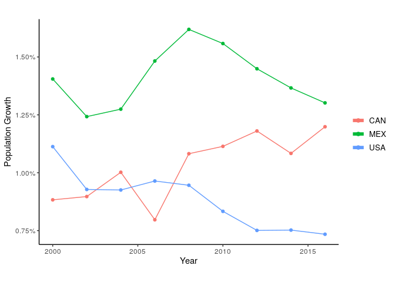
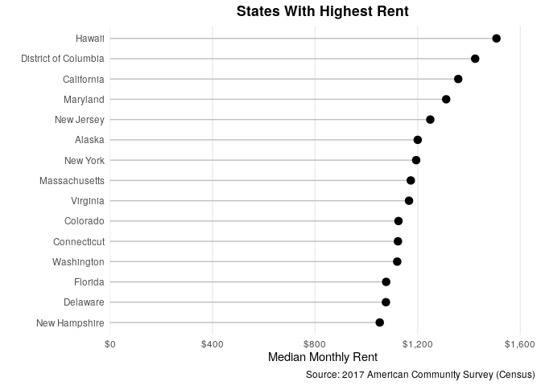

R Quickstart
================
Jesse Cambon
27 November, 2019

Goal: Simple, minimal code for getting started with R.

## Todo

  - Clearly label before and after datasets to illustrate data
    transformations
  - basic minimal ggplots (histogram, point, bar, line)

## Setup

``` r
library(tidyverse)
library(ggplot2)

# Set default ggplot theme
theme_set(theme_bw()+
  theme(legend.position = "top",
            plot.subtitle= element_text(face="bold",hjust=0.5),
            plot.title = element_text(lineheight=1, face="bold",hjust = 0.5)))
```

## Data Manipulation

### Stacking Data

Initial ‘mpg’ Dataset:

| manufacturer | model | displ | year | cyl | trans      | drv | cty | hwy | fl | class   |
| :----------- | :---- | ----: | ---: | --: | :--------- | :-- | --: | --: | :- | :------ |
| audi         | a4    |   1.8 | 1999 |   4 | auto(l5)   | f   |  18 |  29 | p  | compact |
| audi         | a4    |   1.8 | 1999 |   4 | manual(m5) | f   |  21 |  29 | p  | compact |
| audi         | a4    |   2.0 | 2008 |   4 | manual(m6) | f   |  20 |  31 | p  | compact |

``` r
mpg1 <- mpg %>% slice(1:2) %>% 
  select(manufacturer,model,hwy,cty) %>%
  mutate(dataset=1)

mpg2 <- mpg %>% slice(44:45) %>%
  select(manufacturer,model,hwy,cty) %>%
  mutate(dataset=2)

mpg_stack_vert <- mpg1 %>% 
  bind_rows(mpg2)

mpg3 <- mpg %>% slice(1:2,5:6) %>%
  select(displ,year)

mpg_stack_horz <- mpg_stack_vert %>%
  bind_cols(mpg3)

car_type <- mpg %>% select(manufacturer,model,class) %>%
  distinct() # distinct rows only

joined <- mpg_stack_horz %>%
  left_join(car_type,by=c('manufacturer','model')) %>% 
  select(-dataset,everything())
```

### Long to Wide

Initial Data:

| GEOID | NAME    | variable | estimate | moe |
| :---- | :------ | :------- | -------: | --: |
| 01    | Alabama | income   |    24476 | 136 |
| 01    | Alabama | rent     |      747 |   3 |
| 02    | Alaska  | income   |    32940 | 508 |
| 02    | Alaska  | rent     |     1200 |  13 |

  - pivot\_wider
      - names\_from: column containing values that we will use for our
        new column names

<!-- end list -->

``` r
col_ratio <- us_rent_income %>%
  select(-GEOID,-moe) %>%
  pivot_wider(names_from = variable, values_from = estimate) %>% 
  drop_na() %>%   # drop missing values
  mutate(income_rent_ratio = income / (12*rent))
```

Income and Rent are now in separate columns:

| NAME     | income | rent | income\_rent\_ratio |
| :------- | -----: | ---: | ------------------: |
| Alabama  |  24476 |  747 |            2.730478 |
| Alaska   |  32940 | 1200 |            2.287500 |
| Arizona  |  27517 |  972 |            2.359139 |
| Arkansas |  23789 |  709 |            2.796074 |

### Wide to Long

Initial Data:

| country | indicator   |         2000 |         2001 |         2002 |        2003 |         2004 |         2005 |          2006 |           2007 |           2008 |           2009 |           2010 |         2011 |         2012 |        2013 |         2014 |         2015 |        2016 |         2017 |
| :------ | :---------- | -----------: | -----------: | -----------: | ----------: | -----------: | -----------: | ------------: | -------------: | -------------: | -------------: | -------------: | -----------: | -----------: | ----------: | -----------: | -----------: | ----------: | -----------: |
| ABW     | SP.URB.TOTL | 42444.000000 | 43048.000000 | 43670.000000 | 44246.00000 | 4.466900e+04 | 4.488900e+04 |   4.48810e+04 |   4.468600e+04 |   4.437500e+04 |   4.405200e+04 |   4.377800e+04 | 4.382200e+04 | 4.406400e+04 | 4.43600e+04 | 4.467400e+04 | 4.497900e+04 | 4.52750e+04 | 4.557200e+04 |
| ABW     | SP.URB.GROW |     1.182632 |     1.413021 |     1.434559 |     1.31036 | 9.514777e-01 | 4.913027e-01 | \-1.78233e-02 | \-4.354289e-01 | \-6.984006e-01 | \-7.305493e-01 | \-6.239346e-01 | 1.004566e-01 | 5.507148e-01 | 6.69504e-01 | 7.053514e-01 | 6.804037e-01 | 6.55929e-01 | 6.538489e-01 |
| ABW     | SP.POP.TOTL | 90853.000000 | 92898.000000 | 94992.000000 | 97017.00000 | 9.873700e+04 | 1.000310e+05 |   1.00832e+05 |   1.012200e+05 |   1.013530e+05 |   1.014530e+05 |   1.016690e+05 | 1.020530e+05 | 1.025770e+05 | 1.03187e+05 | 1.037950e+05 | 1.043410e+05 | 1.04822e+05 | 1.052640e+05 |

  - pivot\_longer
      - cols (1st arg): what columns do we want to pivot? (ie. subtract
        ones we don’t want to)
      - names\_to : the name of new column holding the column names as
        values
      - values\_to : name of new column containing values
  - seq(start, stop, increment) -\> generates sequence

<!-- end list -->

``` r
wb_pop <- world_bank_pop %>%
  pivot_longer(c(-country,-indicator), names_to = "year", values_to = "value") %>%
  mutate(year=as.numeric(year)) %>% # convert to numeric
  filter(year %in% seq(2000,2016,2))
```

After:

| country | indicator   | year | value |
| :------ | :---------- | ---: | ----: |
| ABW     | SP.URB.TOTL | 2000 | 42444 |
| ABW     | SP.URB.TOTL | 2002 | 43670 |
| ABW     | SP.URB.TOTL | 2004 | 44669 |

### Counting

``` r
count_cyl <- mpg %>%
  count(cyl)
```

| cyl |  n |
| --: | -: |
|   4 | 81 |
|   5 |  4 |
|   6 | 79 |
|   8 | 70 |

### Calculate Summary Stats

``` r
mpg_stats <- mpg %>% select(class,hwy) %>%
  mutate(class_c=case_when(class %in% c("2seater","subcompact") ~ "subcompact",
                               TRUE ~ class)) %>%
  group_by(class_c) %>%
  summarize(count=n(),
            max_hwy=max(hwy),
            min_hwy=min(hwy),
            median_hwy=median(hwy),
            mean_hwy=mean(hwy)) %>%
  ungroup() %>%
  arrange(desc(count)) # sort dataset
```

Note that ‘2seater’ is reclassified as ‘subcompact’

| class\_c   | count | max\_hwy | min\_hwy | median\_hwy | mean\_hwy |
| :--------- | ----: | -------: | -------: | ----------: | --------: |
| suv        |    62 |       27 |       12 |        17.5 |  18.12903 |
| compact    |    47 |       44 |       23 |        27.0 |  28.29787 |
| midsize    |    41 |       32 |       23 |        27.0 |  27.29268 |
| subcompact |    40 |       44 |       20 |        26.0 |  27.72500 |
| pickup     |    33 |       22 |       12 |        17.0 |  16.87879 |
| minivan    |    11 |       24 |       17 |        23.0 |  22.36364 |

## Visualizations

### Bar Chart

  - use fill argument in ggplot() to set bar color based on a variable
  - reorder() orders the bars

<!-- end list -->

``` r
# A simple bar chart - average heights of the species
# the reorder command orders our bars in order of descending height
ggplot(data=mpg_stats,
    aes(x = reorder(class_c,-mean_hwy), y=mean_hwy)) +
geom_bar(stat='identity',position='dodge',color='black') +
scale_y_continuous(expand = c(0,0,0.08,0)) +    # plot margins
geom_text(aes(label=round(mean_hwy)), vjust=-0.5) +  # labelling
theme(legend.position="none", # no legend (in case we want to use fill)
      panel.grid = element_blank()) + # turn off grid
labs(title='') +
xlab('') +
ylab('')
```

<!-- -->

``` r
# Histogram with autobinning based on gender
ggplot(mpg,aes(hwy)) +
geom_histogram(aes(fill=cyl)) +
scale_y_continuous(expand = c(0,0,0.08,0)) + 
xlab('') + ylab('')
```

## Line

``` r
ggplot(wb_pop %>% filter(country %in% c("USA","CAN","MEX") & indicator == "SP.POP.GROW"),
          aes(x=year,y=value,color = country)) +
  theme_classic() +
geom_line() + geom_point() + # lines and points
scale_x_continuous(expand=c(0.02,0,0.02,0)) +
#scale_y_continuous(labels=scales::comma) + 
labs(title='',
     caption='') +
theme(legend.title = element_blank(),
      panel.grid.minor.x = element_blank(),
      legend.text=element_text(size=10),
      legend.position='right') +
xlab('Year') +
ylab('Population Growth (millions)') +
# make legend lines bigger
guides(colour = guide_legend(override.aes = list(size=2.5))) 
```

<!-- -->

## Lollipop

``` r
  ggplot(data=col_ratio %>% arrange(desc(rent)) %>% head(8), aes(x=NAME, y=rent) ) +
    geom_segment( aes(x=reorder(NAME,rent) ,xend=NAME, y=0, yend=rent), color="grey") +
    geom_point(size=3, color="navy") +
   theme_minimal() +
  theme(    plot.subtitle= element_text(face="bold",hjust=0.5),
            plot.title = element_text(lineheight=1, face="bold",hjust = 0.5),
      panel.grid.minor.y = element_blank(),
      panel.grid.major.y = element_blank(),
      panel.grid.minor.x = element_blank(),
      legend.position="none"
    ) +
  coord_flip() +
    # expand gets rid of space between labels stem of lollipops
    scale_y_continuous(expand = c(0, 0,0,70)) + 
    labs(title='States With Highest Rent',
        caption='') +
    xlab("") +
    ylab('')
```

<!-- -->
