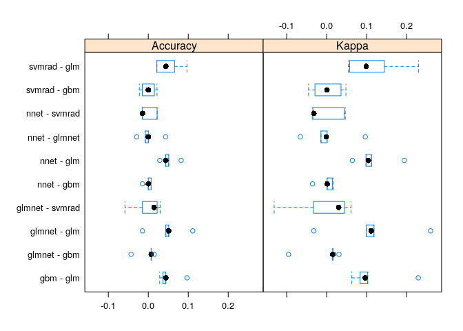

Machine Learning with Caret
================
Jesse Cambon
18 September, 2018

-   [References](#references)
-   [Setup](#setup)
-   [Build Model](#build-model)

Demonstrate a machine learning workflow with caret

References
----------

-   <https://topepo.github.io/caret/model-training-and-tuning.html>

Setup
-----

``` r
library(tidyverse)
#library(broom)
library(knitr)
library(kableExtra)
library(caret)
library(skimr)
```

Build Model
-----------

``` r
library(mlbench) # machine learning reference datasets
data(BreastCancer)

skim(BreastCancer)

BC <- BreastCancer %>% as_tibble() %>%
  dplyr::select(-Id) %>%
  drop_na() # should really use imputation but we'll do this for now

# Use k-fold cross-validation
TC <- trainControl(method="cv", number=10)

# Neural Network
nnet <- train(Class ~ .,  # decide out outcome variable
               BC, # our dataset
               trControl=TC,
               method='nnet')
nnet

# SVM Radial
svmRad <- train(Class ~ .,  # decide out outcome variable
               BC, # our dataset
               trControl=TC,
               method='svmRadial')

svmRad

# Bayesian Logistic Regression
logistic <- train(Class ~ .,  # decide out outcome variable
               BC, # our dataset
               trControl=TC,
               method='bayesglm')

logistic
```

``` r
resamps <- resamples(list(neuralnet=nnet,
                          SVMRad=svmRad,
                          logistic=logistic))
#resamps

#'svmLinear','nnet','svmRadial'

dotplot(resamps, metric = "Accuracy")
```


``` r
bwplot(diff(resamps))
```


