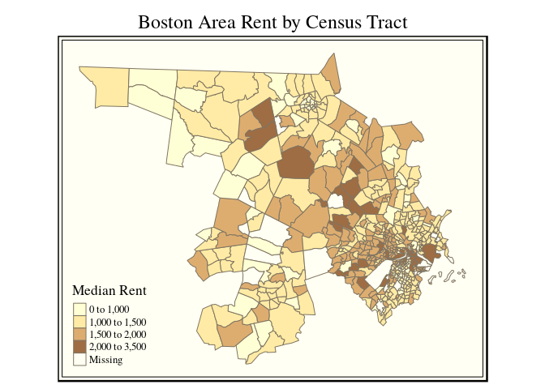

Geospatial Analysis
================
Jesse Cambon
31 August, 2018

-   [References](#references)
-   [Setup](#setup)
-   [Geographies](#geographies)
    -   [Locales](#locales)
    -   [United States](#united-states)
    -   [The World](#the-world)

References
----------

-   <https://github.com/mtennekes/tmap>
-   <https://mran.revolutionanalytics.com/snapshot/2016-03-22/web/packages/tmap/vignettes/tmap-nutshell.html>

Setup
-----

``` r
library(tidyverse)
library(tidycensus) # census data
library(ggplot2)
#library(sf) # geospatial methods
library(tmap) # thematic mapping
library(viridis) # color scheme
#library(wbstats) # world bank
library(wesanderson) # colors
library(fiftystater) # US state geometries

options(tigris_use_cache = TRUE)
```

Geographies
===========

Locales
-------

Use the tidycensus package to pull Census data and display it on a map with the tmap package.

``` r
# Pull Census Rent Data for Boston using tidycensus package
bos <- get_acs(geography = "tract", 
              variables = "B25064_001E",  # median gross rent
              state = "MA", 
              county = c("Suffolk",'Middlesex'), 
              geometry = TRUE)

tm_shape(bos) +
  tm_fill('estimate',colorNA = "white",breaks=c(0,1000,1500,2000,3500),
          fill.title='Median Rent') +
  tm_borders() +
   tm_style("classic") +
  # margin format is c(bottom,left,top,right)
  tm_layout(inner.margins = c(0.05, .05, .05, .05),main.title.position='center',legend.position=c('left','bottom'),
            legend.text.size=0.8,legend.title.size=1.3,
            main.title='Boston Area Rent by Census Tract',
            main.title.size=1.5) 
```



``` r
#vars <- load_variables(2016,'acs1') # view census variables
```

<http://www.robinlovelace.net/presentations/spatial-tidyverse.html#11> <https://cran.r-project.org/web/packages/wbstats/vignettes/Using_the_wbstats_package.html>

United States
-------------

``` r
data("fifty_states") # fiftystater package

crimes <- data.frame(state = tolower(rownames(USArrests)), USArrests) %>%
  # Make a categorical variable for Murder rates with a predefined interval
  mutate(Murder_cut = str_replace_all(cut_width(Murder,5,boundary=0),',',' - ')) %>%
  # Delete all characters except for digits, whitespace, and '-'
  mutate(Murder_cut = str_replace_all(Murder_cut,'[^\\d\\s-]',''))

# make an ordered list of levels so our categorical variable is sorted properly
Murder_cut_levels <- crimes %>% arrange(Murder) %>% pull(Murder_cut) %>%
  unique()


# map_id creates the aesthetic mapping to the state name column in your data
ggplot(crimes, aes(map_id = state)) + 
  # map points to the fifty_states shape data
  geom_map(aes(fill = factor(Murder_cut,levels=Murder_cut_levels)), 
           map = fifty_states, color='white',size=0.2) +  # geometry from fiftystater package
  expand_limits(x = fifty_states$long, y = fifty_states$lat) +
  coord_map() +
  theme(plot.title = element_text(lineheight=1, face="bold",hjust = 0.5)) + 
  scale_x_continuous(breaks = NULL) + 
  scale_y_continuous(breaks = NULL) +
  
  labs(x = "", y = "",title='State Murder Rates in 1975',
   caption='Data: World Almanac and Book of facts 1975. (Crime rates)') +
  theme(legend.position = "right", 
        panel.background = element_blank(),
        panel.border=element_blank())  +
  scale_fill_viridis_d(direction=-1,option='inferno',end=0.9)  +
  guides(fill = guide_legend(title='Murders Per\n100,000 Residents'))
```


The World
---------

``` r
data(World)
tm_shape(World, projection = "eck4" # Eckert IV 1906 project (preserves area)
         ) +
  tm_polygons("gdp_cap_est",
              palette = "Greens",
              breaks = c(0, 1000, 5000, 10000, 25000, 50000, Inf),
              title = "GDP per capita") +
  tm_style("classic",frame=F,
           earth.boundary = c(-180, -87, 180, 87),
           legend.text.size=0.8,legend.title.size=1.3)   +
#  tm_format("World", inner.margins = 0.02, frame = FALSE) 
  tm_legend(frame = TRUE) 
```


``` r
# tm_format("World",frame=F) 
```
