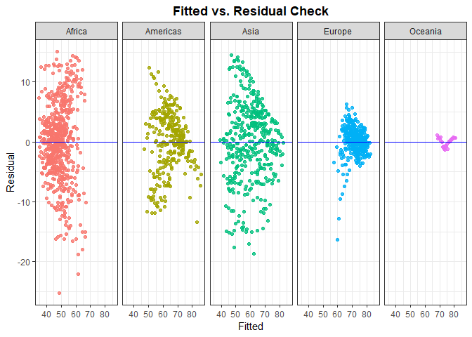

Modeling Workflow
================
Jesse Cambon
16 September, 2018

-   [References](#references)
-   [Setup](#setup)
-   [Exploration](#exploration)
-   [Grouped Models](#grouped-models)
-   [Nested Models](#nested-models)

Demonstrate model workflows with tidyverse, modelr, and broom.

References
----------

-   <http://r4ds.had.co.nz/many-models.html>

Setup
-----

``` r
library(tidyverse)
library(gapminder)
library(broom)
library(modelr)
library(knitr)
library(kableExtra)
```

Exploration
-----------

These graphs show why log transforming GDP per Capita makes it correlate more linearly to our response variable, life expectancy. Log transformations are often useful for highly skewed variables in regression.

``` r
ggplot(data=gapminder,
          aes(x = gdpPercap, y = lifeExp, color = continent,group=1)) +
geom_point(alpha=0.7) +
theme_bw() +
geom_smooth() +
theme(legend.position='top',
  plot.title = element_text(lineheight=1, face="bold",hjust = 0.5)) + 
guides(color=guide_legend(override.aes = list(size=2.5))) 
```

    ## `geom_smooth()` using method = 'gam' and formula 'y ~ s(x, bs = "cs")'


``` r
ggplot(data=gapminder,
          aes(x = log(gdpPercap), y = lifeExp, color = continent,group=1)) +
geom_point(alpha=0.7) +
theme_bw() +
geom_smooth() +
theme(legend.position='top',
  plot.title = element_text(lineheight=1, face="bold",hjust = 0.5)) + 
guides(color=guide_legend(override.aes = list(size=2.5))) 
```

    ## `geom_smooth()` using method = 'gam' and formula 'y ~ s(x, bs = "cs")'


Grouped Models
--------------

``` r
# One model per continent
models <- gapminder %>%
  group_by(continent) %>%
  do(fit=lm(lifeExp ~ (log(gdpPercap)*log(pop)) + year, data=.)) 

stats <- glance(models,fit) %>%
  arrange(desc(r.squared))

coefficients <- tidy(models,fit) %>%
  filter(term != '(Intercept)') %>%
  arrange(continent,desc(p.value))

fit_check <- augment(models,fit)
```

``` r
ggplot(data=fit_check,
          aes(x = .fitted, y = .resid, color = continent,group=1)) +
geom_point(alpha=0.8) +
facet_grid(~continent) +
ggtitle('Fitted vs. Residual Check') +
theme_bw() +
geom_hline(yintercept=0,color='blue') + # horizontal line at 0 residual
theme(legend.position='none',
  plot.title = element_text(lineheight=1, face="bold",hjust = 0.5)) + 
guides(color=guide_legend(override.aes = list(size=2.5))) +
xlab('Fitted') +
ylab('Residual')
```



``` r
ggplot(data=fit_check,
          aes(.resid)) +
geom_histogram(aes(fill=continent)) +
facet_grid(~continent) +
ggtitle('Residual Distribution') +
theme_bw() +
scale_y_continuous(expand = c(0,0,0.05,0)) + 
theme(legend.position='none',
  plot.title = element_text(lineheight=1, face="bold",hjust = 0.5)) + 
guides(color=guide_legend(override.aes = list(size=2.5))) +
xlab('Residual') +
ylab('Count')
```

    ## `stat_bin()` using `bins = 30`. Pick better value with `binwidth`.


``` r
kable(stats,format='markdown',digits=2) %>%
  kable_styling(bootstrap_options = c("striped",'border'))
```

<table style="width:100%;">
<colgroup>
<col width="9%" />
<col width="9%" />
<col width="12%" />
<col width="5%" />
<col width="9%" />
<col width="7%" />
<col width="3%" />
<col width="8%" />
<col width="7%" />
<col width="7%" />
<col width="8%" />
<col width="10%" />
</colgroup>
<thead>
<tr class="header">
<th align="left">continent</th>
<th align="right">r.squared</th>
<th align="right">adj.r.squared</th>
<th align="right">sigma</th>
<th align="right">statistic</th>
<th align="right">p.value</th>
<th align="right">df</th>
<th align="right">logLik</th>
<th align="right">AIC</th>
<th align="right">BIC</th>
<th align="right">deviance</th>
<th align="right">df.residual</th>
</tr>
</thead>
<tbody>
<tr class="odd">
<td align="left">Oceania</td>
<td align="right">0.98</td>
<td align="right">0.98</td>
<td align="right">0.55</td>
<td align="right">267.69</td>
<td align="right">0</td>
<td align="right">5</td>
<td align="right">-16.97</td>
<td align="right">45.93</td>
<td align="right">53.00</td>
<td align="right">5.78</td>
<td align="right">19</td>
</tr>
<tr class="even">
<td align="left">Europe</td>
<td align="right">0.82</td>
<td align="right">0.82</td>
<td align="right">2.32</td>
<td align="right">401.67</td>
<td align="right">0</td>
<td align="right">5</td>
<td align="right">-811.93</td>
<td align="right">1635.85</td>
<td align="right">1659.17</td>
<td align="right">1917.78</td>
<td align="right">355</td>
</tr>
<tr class="odd">
<td align="left">Americas</td>
<td align="right">0.72</td>
<td align="right">0.72</td>
<td align="right">4.94</td>
<td align="right">193.54</td>
<td align="right">0</td>
<td align="right">5</td>
<td align="right">-902.49</td>
<td align="right">1816.98</td>
<td align="right">1839.20</td>
<td align="right">7204.74</td>
<td align="right">295</td>
</tr>
<tr class="even">
<td align="left">Asia</td>
<td align="right">0.70</td>
<td align="right">0.70</td>
<td align="right">6.48</td>
<td align="right">233.04</td>
<td align="right">0</td>
<td align="right">5</td>
<td align="right">-1299.55</td>
<td align="right">2611.11</td>
<td align="right">2634.99</td>
<td align="right">16431.20</td>
<td align="right">391</td>
</tr>
<tr class="odd">
<td align="left">Africa</td>
<td align="right">0.51</td>
<td align="right">0.50</td>
<td align="right">6.46</td>
<td align="right">158.00</td>
<td align="right">0</td>
<td align="right">5</td>
<td align="right">-2046.79</td>
<td align="right">4105.58</td>
<td align="right">4132.19</td>
<td align="right">25809.37</td>
<td align="right">619</td>
</tr>
</tbody>
</table>

``` r
kable(coefficients,format='markdown',digits=4) %>%
  kable_styling(bootstrap_options = c("striped",'border'))
```

| continent | term                    |  estimate|  std.error|  statistic|  p.value|
|:----------|:------------------------|---------:|----------:|----------:|--------:|
| Africa    | log(gdpPercap)          |   -2.1548|     3.1663|    -0.6805|   0.4964|
| Africa    | log(gdpPercap):log(pop) |    0.4601|     0.2090|     2.2018|   0.0280|
| Africa    | log(pop)                |   -3.6438|     1.5592|    -2.3369|   0.0198|
| Africa    | year                    |    0.2595|     0.0161|    16.0987|   0.0000|
| Americas  | log(pop)                |    3.5029|     2.5847|     1.3552|   0.1764|
| Americas  | log(gdpPercap):log(pop) |   -0.4837|     0.2871|    -1.6850|   0.0931|
| Americas  | log(gdpPercap)          |   15.9641|     4.7199|     3.3823|   0.0008|
| Americas  | year                    |    0.2620|     0.0183|    14.3191|   0.0000|
| Asia      | log(gdpPercap)          |    1.7829|     2.1504|     0.8291|   0.4075|
| Asia      | log(pop)                |   -0.9726|     1.0905|    -0.8920|   0.3730|
| Asia      | log(gdpPercap):log(pop) |    0.2315|     0.1332|     1.7380|   0.0830|
| Asia      | year                    |    0.2925|     0.0220|    13.2700|   0.0000|
| Europe    | log(gdpPercap)          |   -5.9844|     2.0606|    -2.9043|   0.0039|
| Europe    | log(gdpPercap):log(pop) |    0.7032|     0.1310|     5.3696|   0.0000|
| Europe    | log(pop)                |   -7.0422|     1.2337|    -5.7080|   0.0000|
| Europe    | year                    |    0.0969|     0.0088|    11.0761|   0.0000|
| Oceania   | log(gdpPercap)          |  -57.6467|    12.9252|    -4.4600|   0.0003|
| Oceania   | log(pop)                |  -30.5644|     6.6653|    -4.5856|   0.0002|
| Oceania   | log(gdpPercap):log(pop) |    3.2094|     0.6931|     4.6306|   0.0002|
| Oceania   | year                    |    0.3236|     0.0421|     7.6815|   0.0000|

Nested Models
-------------

Now we create a similar model with nesting

``` r
my_model <- function(df) {
  lm(lifeExp ~ (log(gdpPercap)*log(pop)) + year, data= df)
}

# Nest models by continent 

nested_models <- gapminder %>% 
  group_by(continent,country) %>% 
  nest() %>%
  # fit models
  mutate(fit = map(data, my_model)) %>%
  # calculate residuals
  mutate(augment = map(fit, augment),
    stats = map(fit,glance),
    terms = map(fit,tidy)) %>%
  ungroup()

# Dataset with predictions and residuals
model_fit <- nested_models %>% unnest(augment)

nest_stats <- nested_models %>%
  unnest(stats,.drop=TRUE) %>%
  arrange(desc(r.squared)) 

nest_coefficients <- nested_models %>%
  unnest(terms,.drop=TRUE) %>%
  filter(term != '(Intercept)') %>%
  arrange(continent,country,desc(p.value))

most_important_vars <- nest_coefficients %>%
  group_by(country) %>% 
  slice(1)

summ_imp_vars <- most_important_vars %>%
  group_by(continent) %>%
  count(term) %>%
  arrange(continent,desc(n))
```
