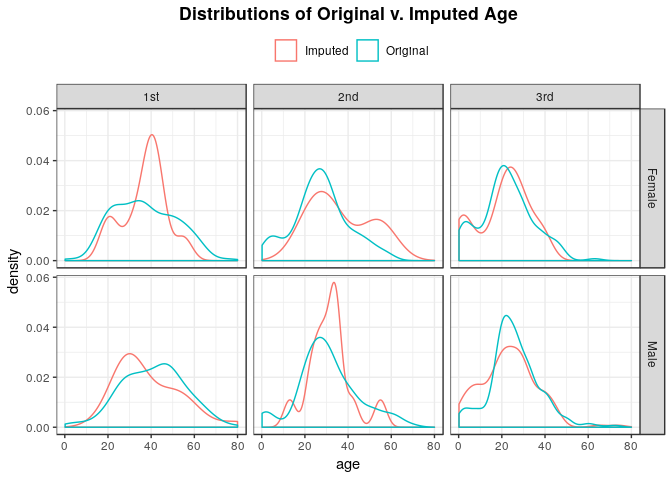
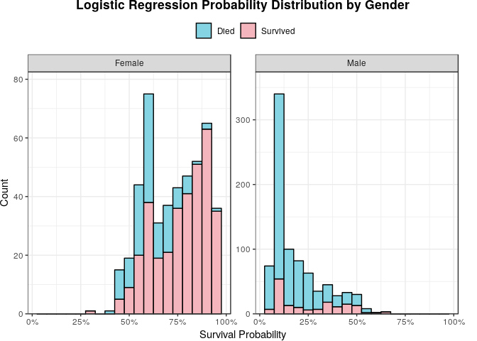
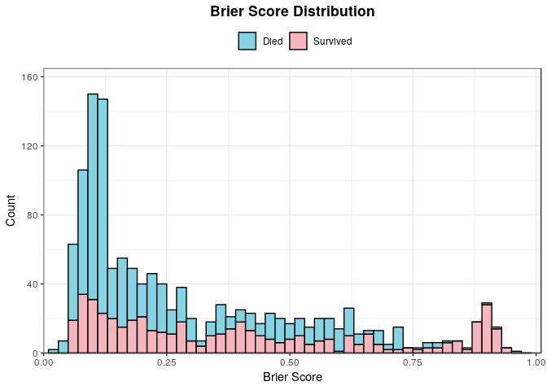
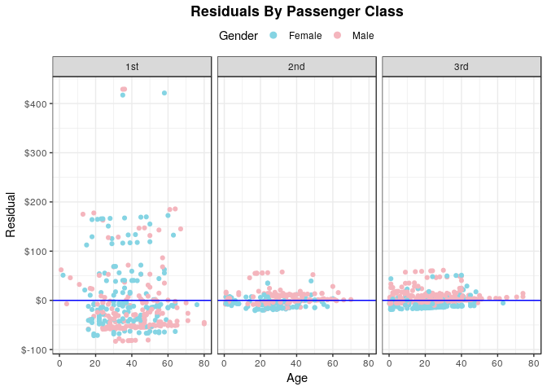

Modeling Fundamentals - The Titanic
================
Jesse Cambon
29 August, 2018

-   [References](#references)
-   [Setup](#setup)
-   [Exploratory Analysis](#exploratory-analysis)
-   [Imputation](#imputation)
-   [Logistic Regression Model](#logistic-regression-model)
-   [Linear Regression Model](#linear-regression-model)

This page is meant to serve as a primer for modeling in R. A linear and logistic regression are demonstrated on the Titanic dataset to model fare prices and survival rates using gender, age, and passenger class as covariates. Data imputation is performed on age in order to avoid biasing results. The broom package is used to display the results of the models and graphical methods are used throughout to explore the dataset and evaluate the fit of each model.

### References

-   Intro to Statistical Learning: <http://www-bcf.usc.edu/~gareth/ISL/>
-   Logistic Regression: <https://stats.idre.ucla.edu/r/dae/logit-regression/>

Setup
-----

``` r
library(PASWR) #titanic3 dataset
library(MASS) # confint for glm
library(wesanderson) # color palettes
library(formattable) # percent format
library(caret) # regression utilities
#library(Hmisc) # capitalize function
library(broom) # model display capabilities
#library(xtable) # pretty table
library(kableExtra)
library(tidyverse)
library(skimr) #summary stats
library(knitr)  
#library(rms)

titanic <- titanic3 %>% as_tibble() %>%
  mutate(sex=str_to_title(sex))

titanic_summ <- titanic %>%
  count(survived,pclass,sex) %>%
  group_by(pclass,sex) %>%
  mutate(perc_surv_num=n/sum(n),
    perc_surv_char=as.character(percent(n/sum(n),0))) %>%
  ungroup() %>%
  mutate(survived=factor(survived,labels=c('Died','Survived')))

# Set default ggplot theme
theme_set(theme_bw()+
  theme(legend.position = "top",
            plot.subtitle= element_text(face="bold",hjust=0.5),
            plot.title = element_text(lineheight=1, face="bold",hjust = 0.5)))
```

Exploratory Analysis
--------------------

``` r
skim_to_wide(titanic %>% select(survived,sex,pclass,age,fare)) %>%
  select(-top_counts,-ordered,-n_unique,-hist,-complete,-empty) %>%
  kable()
```

<table>
<thead>
<tr>
<th style="text-align:left;">
type
</th>
<th style="text-align:left;">
variable
</th>
<th style="text-align:left;">
missing
</th>
<th style="text-align:left;">
n
</th>
<th style="text-align:left;">
min
</th>
<th style="text-align:left;">
max
</th>
<th style="text-align:left;">
mean
</th>
<th style="text-align:left;">
sd
</th>
<th style="text-align:left;">
p0
</th>
<th style="text-align:left;">
p25
</th>
<th style="text-align:left;">
p50
</th>
<th style="text-align:left;">
p75
</th>
<th style="text-align:left;">
p100
</th>
</tr>
</thead>
<tbody>
<tr>
<td style="text-align:left;">
character
</td>
<td style="text-align:left;">
sex
</td>
<td style="text-align:left;">
0
</td>
<td style="text-align:left;">
1309
</td>
<td style="text-align:left;">
4
</td>
<td style="text-align:left;">
6
</td>
<td style="text-align:left;">
NA
</td>
<td style="text-align:left;">
NA
</td>
<td style="text-align:left;">
NA
</td>
<td style="text-align:left;">
NA
</td>
<td style="text-align:left;">
NA
</td>
<td style="text-align:left;">
NA
</td>
<td style="text-align:left;">
NA
</td>
</tr>
<tr>
<td style="text-align:left;">
factor
</td>
<td style="text-align:left;">
pclass
</td>
<td style="text-align:left;">
0
</td>
<td style="text-align:left;">
1309
</td>
<td style="text-align:left;">
NA
</td>
<td style="text-align:left;">
NA
</td>
<td style="text-align:left;">
NA
</td>
<td style="text-align:left;">
NA
</td>
<td style="text-align:left;">
NA
</td>
<td style="text-align:left;">
NA
</td>
<td style="text-align:left;">
NA
</td>
<td style="text-align:left;">
NA
</td>
<td style="text-align:left;">
NA
</td>
</tr>
<tr>
<td style="text-align:left;">
integer
</td>
<td style="text-align:left;">
survived
</td>
<td style="text-align:left;">
0
</td>
<td style="text-align:left;">
1309
</td>
<td style="text-align:left;">
NA
</td>
<td style="text-align:left;">
NA
</td>
<td style="text-align:left;">
0.38
</td>
<td style="text-align:left;">
0.49
</td>
<td style="text-align:left;">
0
</td>
<td style="text-align:left;">
0
</td>
<td style="text-align:left;">
0
</td>
<td style="text-align:left;">
1
</td>
<td style="text-align:left;">
1
</td>
</tr>
<tr>
<td style="text-align:left;">
numeric
</td>
<td style="text-align:left;">
age
</td>
<td style="text-align:left;">
263
</td>
<td style="text-align:left;">
1309
</td>
<td style="text-align:left;">
NA
</td>
<td style="text-align:left;">
NA
</td>
<td style="text-align:left;">
29.88
</td>
<td style="text-align:left;">
14.41
</td>
<td style="text-align:left;">
0.17
</td>
<td style="text-align:left;">
21
</td>
<td style="text-align:left;">
28
</td>
<td style="text-align:left;">
39
</td>
<td style="text-align:left;">
80
</td>
</tr>
<tr>
<td style="text-align:left;">
numeric
</td>
<td style="text-align:left;">
fare
</td>
<td style="text-align:left;">
1
</td>
<td style="text-align:left;">
1309
</td>
<td style="text-align:left;">
NA
</td>
<td style="text-align:left;">
NA
</td>
<td style="text-align:left;">
33.3
</td>
<td style="text-align:left;">
51.76
</td>
<td style="text-align:left;">
0
</td>
<td style="text-align:left;">
7.9
</td>
<td style="text-align:left;">
14.45
</td>
<td style="text-align:left;">
31.27
</td>
<td style="text-align:left;">
512.33
</td>
</tr>
</tbody>
</table>
``` r
titanic_summ_dot <- titanic_summ %>%
  filter(survived=="Survived") %>%
  mutate(group=str_c(sex,'-',pclass))
  
# Analyze where age is missing
titanic_miss <- titanic %>% select(pclass,sex,age,survived) %>%
  mutate(missing_age=is.na(age)) %>%
  group_by(pclass,sex) %>%
  dplyr::summarize(perc_missing=mean(missing_age)) %>%
  mutate(group=str_c(sex,'-',pclass))
  

ggplot(titanic_summ_dot, aes(x=reorder(group,-perc_surv_num), y=perc_surv_num)) + 
  geom_point(size=3,color='black') +   # Draw points
  theme(legend.position='none',
        panel.grid=element_blank()) +
  scale_y_continuous(expand=c(0,0,0.015,0),labels=scales::percent) +
  geom_segment(aes(x=group,
                   xend=group,
                   y=min(0),
                   yend=max(1)),
               linetype="dashed", color='black',
               size=0.1) +   # Draw dashed lines
  labs(title="Titanic Passenger Survival Rates") +  
  coord_flip() +
  xlab('Group') +
  ylab('Survival Rate') 
```


``` r
ggplot(data=titanic_summ,
       aes(x = fct_rev(pclass), y=perc_surv_num,fill = survived)) +
facet_grid(~factor(sex)) +
geom_bar(stat='identity',color='black') +
coord_flip() +
  geom_text(data=titanic_summ,aes(label = ifelse(perc_surv_num > 0.07 ,perc_surv_char,NA)),
    size = 3,position = position_stack(vjust = 0.5)) +
scale_fill_manual(values=wes_palette('FantasticFox1')[c(3,4)]) +
theme(axis.text.x=element_blank(),
        axis.ticks.x=element_blank(),
      panel.grid = element_blank())+
labs(title='Passenger Survival Rates by Gender and Class') +
xlab('Passenger Class') +
ylab('') +
guides(fill = guide_legend(title='',reverse=T)) # reverse legend order
```


``` r
ggplot(titanic_miss, aes(x=reorder(group,-perc_missing), y=perc_missing)) + 
  geom_point(size=3,color='black') +   # Draw points
  theme(legend.position='none',
        panel.grid=element_blank()) +
  scale_y_continuous(labels=scales::percent) +
  geom_segment(aes(x=group,
                   xend=group,
                   y=min(perc_missing),
                   yend=max(perc_missing)),
               linetype="dashed", color='black',
               size=0.1) +   # Draw dashed lines
  labs(title="Which Passengers Have Missing Age") +  
  coord_flip() +
  xlab('Group') +
  ylab('Percent Missing Age') 
```


Imputation
----------

Discarding rows with missing age has the potential to bias our data so we will impute.

<https://www.analyticsvidhya.com/blog/2016/03/tutorial-powerful-packages-imputing-missing-values/> <https://www.andrew.cmu.edu/user/aurorat/MIA_r.html> <http://www.gerkovink.com/miceVignettes/Convergence_pooling/Convergence_and_pooling.html>

``` r
library(mice)
```

    ## Warning: package 'mice' was built under R version 3.5.1

    ## 
    ## Attaching package: 'mice'

    ## The following object is masked from 'package:tidyr':
    ## 
    ##     complete

    ## The following objects are masked from 'package:base':
    ## 
    ##     cbind, rbind

``` r
# Use mice to impute data - takes a few seconds on my laptop
# Increasing maxit from the default gives better results
# Making sure to not sure the outcome variable to impute.
titanic_imputed <- mice(titanic %>% select(sex,pclass,age), method = 'pmm', maxit=80,seed = 3530,printFlag=F)
```

    ## Warning: Number of logged events: 1

``` r
#imp_with <- with(titanic_imputed, lm(age ~ pclass + sex + fare))
#pooled <- pool(imp_with)

# check the fit
#summary(pooled)

# Add imputed Data
titanic_imp <- complete(titanic_imputed,5) %>%
  bind_cols(titanic %>% select(survived,age,fare) %>% rename(age_orig=age)) %>%
  mutate(imputed=case_when(is.na(age_orig) ~ 'Imputed', TRUE ~ 'Original'))


# Plot

ggplot(data=titanic_imp) +
 geom_density(aes(x=age,color=imputed), alpha=0.8) + 
  #facet_grid(vars(sex),vars(pclass)) +
  theme(legend.position='top') +
    labs(title="Distributions of Original v. Imputed Age") +
  guides(color=guide_legend(title=''))
```


``` r
ggplot(data=titanic_imp) +
 geom_density(aes(x=age,color=imputed), alpha=0.8) + 
  facet_grid(sex ~ pclass) +
  theme(legend.position='top') +
    labs(title="Distributions of Original v. Imputed Age") +
  guides(color=guide_legend(title=''))
```



Logistic Regression Model
-------------------------

We will use the brier score as one measurement of accuracy for our model: <https://en.wikipedia.org/wiki/Brier_score> The book 'Superforecasting' by Philip Tetlock has a good discussion of the use of brier scores.

``` r
log_fit <- glm(survived ~ sex + pclass + age ,family=binomial(link="logit"),data=titanic_imp)

predictions <- titanic_imp %>%
  select(sex,pclass,age,survived) %>%
  mutate(prediction=predict(log_fit,newdata=titanic_imp,type='response')) %>%
  mutate(prediction_binary=case_when(prediction >0.5 ~ 1, TRUE ~ 0),
         brier_score=abs(prediction-survived))

#summary(fit)

log_confint <- confint(log_fit) %>% tidy()
```

    ## Waiting for profiling to be done...

``` r
colnames(log_confint) <- c('Term','LCLM','UCLM')

log_info <- glance(log_fit) %>% 
  mutate(meanBrierScore=mean(predictions$brier_score,na.rm=T)) %>%
  dplyr::select(meanBrierScore,everything())

log_terms <- tidy(log_fit) %>% rename(Coefficient=estimate,Term=term) %>%
   # Order by largest coefficient but put intercept term on bottom
  left_join(log_confint,by='Term') %>%
  mutate(OR=exp(Coefficient),LCLM_OR=exp(LCLM),UCLM_OR=exp(UCLM)) %>%
  select(Term,Coefficient,LCLM,UCLM,OR,LCLM_OR,UCLM_OR,everything()) %>%
  arrange(Term=='(Intercept)',desc(abs(Coefficient)))

# An analysis of our model's classification accuracy
confusionMatrix(factor(predictions$prediction_binary), factor(predictions$survived))
```

    ## Confusion Matrix and Statistics
    ## 
    ##           Reference
    ## Prediction   0   1
    ##          0 686 156
    ##          1 123 344
    ##                                           
    ##                Accuracy : 0.7869          
    ##                  95% CI : (0.7637, 0.8088)
    ##     No Information Rate : 0.618           
    ##     P-Value [Acc > NIR] : < 2e-16         
    ##                                           
    ##                   Kappa : 0.5428          
    ##  Mcnemar's Test P-Value : 0.05539         
    ##                                           
    ##             Sensitivity : 0.8480          
    ##             Specificity : 0.6880          
    ##          Pos Pred Value : 0.8147          
    ##          Neg Pred Value : 0.7366          
    ##              Prevalence : 0.6180          
    ##          Detection Rate : 0.5241          
    ##    Detection Prevalence : 0.6432          
    ##       Balanced Accuracy : 0.7680          
    ##                                           
    ##        'Positive' Class : 0               
    ## 

``` r
ggplot(data=predictions,
          aes(x = age, y = prediction, color = pclass)) +
geom_point() +
facet_grid(~sex) +
scale_y_continuous(labels=scales::percent) +
theme(legend.margin=margin(0,0,0,0)) +
scale_color_manual(values=wes_palette('Moonrise3')) +
labs(title='Probability of Survival - Logistic Regression') +
xlab('Age') +
ylab('Survival Probability') +
guides(color = guide_legend(title='Passenger Class',reverse=F,override.aes = list(size=2.5))) 
```


``` r
ggplot(predictions, aes(prediction))+
  geom_histogram(binwidth=0.02,aes(fill=factor(survived,labels=c('Died','Survived'))),
    col='black') + 
  # prevent right label on axis from being clipped
  theme(legend.pos='top',plot.margin=margin(r = 20, unit = "pt")  ) +
  scale_fill_manual(values=wes_palette('Moonrise3')) +
  scale_x_continuous(labels=scales::percent,
                     limits=c(0,1),
                     expand=c(0,0,0,0)) + # eliminate left/right margin
    scale_y_continuous(expand=expand_scale(mult = c(0, .1))) + 
  labs(title="Logistic Regression Probability Distribution") +
xlab('Survival Probability') +
ylab('Count') +
guides(fill = guide_legend(title='')) 
```


``` r
# Same graph as prior but faceted on class

ggplot(predictions, aes(prediction))+
  geom_histogram(binwidth=0.05,aes(fill=factor(survived,labels=c('Died','Survived'))),
    col='black') + 
  facet_wrap(~sex,scales='free_y') +
  theme(legend.pos='top',
        # prevent right label on axis from being clipped
        plot.margin=margin(r = 20, unit = "pt")
        ) +
  scale_fill_manual(values=wes_palette('Moonrise3')) +
  scale_x_continuous(labels=scales::percent ) +
  scale_y_continuous(expand=expand_scale(mult = c(0, .1))) +
  labs(title="Logistic Regression Probability Distribution by Gender") +
xlab('Survival Probability') +
ylab('Count') +
guides(fill = guide_legend(title='')) 
```



``` r
ggplot(predictions, aes(brier_score)) +
  geom_histogram(binwidth=0.02,aes(fill=factor(survived,labels=c('Died','Survived'))),
                 col='black') +
  labs(title="Brier Score Distribution") +
    scale_fill_manual(values=wes_palette('Moonrise3')) +
  # Use expand to make sure right axis label isn't clipped
    scale_x_continuous(expand=c(0,0,0.01,0),limits=c(0,1)) +
    scale_y_continuous(expand=expand_scale(mult = c(0, .1))) +
xlab('Brier Score') +
ylab('Count') +
guides(fill = guide_legend(title='')) 
```



OR = Odds Ratio. LCLM and UCLM are lower and upper 95% confidence limits.

``` r
kable(log_info %>% 
        select(-df.residual,-df.null,-deviance),format='markdown',digits=2) %>%
  kable_styling(bootstrap_options = c("striped",'border'))
```

|  meanBrierScore|  null.deviance|  logLik|     AIC|      BIC|
|---------------:|--------------:|-------:|-------:|--------:|
|             0.3|        1741.02|  -615.9|  1241.8|  1267.68|

``` r
kable(log_terms,format='markdown',digits = 2) %>%
  kable_styling(bootstrap_options = c("striped",'border'))
```

| Term        |  Coefficient|   LCLM|   UCLM|     OR|  LCLM\_OR|  UCLM\_OR|  std.error|  statistic|  p.value|
|:------------|------------:|------:|------:|------:|---------:|---------:|----------:|----------:|--------:|
| sexMale     |        -2.49|  -2.78|  -2.20|   0.08|      0.06|      0.11|       0.15|     -16.76|        0|
| pclass3rd   |        -2.19|  -2.58|  -1.80|   0.11|      0.08|      0.17|       0.20|     -10.90|        0|
| pclass2nd   |        -1.17|  -1.59|  -0.76|   0.31|      0.20|      0.47|       0.21|      -5.58|        0|
| age         |        -0.03|  -0.04|  -0.02|   0.97|      0.96|      0.98|       0.01|      -4.94|        0|
| (Intercept) |         3.19|   2.64|   3.77|  24.38|     14.00|     43.41|       0.29|      11.08|        0|

Linear Regression Model
-----------------------

A linear model of passenger fare cost.

``` r
lm_fit <- lm(fare ~ sex + pclass + age + survived,data=titanic_imp)

# Calculate confidence limit
lm_confint <- confint(lm_fit) %>% tidy()
colnames(lm_confint) <- c('Term','LCLM','UCLM')

lm_predictions <- titanic_imp %>%
  select(sex,pclass,age,survived,fare) %>%
  mutate(prediction=predict(lm_fit,newdata=titanic_imp)) %>%
  mutate(residual=fare-prediction)

lm_info <- glance(lm_fit)

lm_terms <- tidy(lm_fit) %>%
  rename(Term=term,Coefficient=estimate) %>%
  left_join(lm_confint,by='Term' ) %>%
  select(Term,Coefficient,LCLM,UCLM,everything()) %>%
  arrange(Term=='(Intercept)',desc(abs(Coefficient)))

#summary(lm_fit)

# Histogram of Residuals
ggplot(lm_predictions, aes(residual)) +
  geom_histogram(bins=30) +
facet_grid(~pclass,scales='free_x') +
geom_vline(xintercept=0,color='red',size=0.4) +
scale_x_continuous(labels=scales::dollar ,expand=c(0,0,0,0)
                   ) +
scale_y_continuous(expand=c(0,0,0.07,0)) +  
  labs(title="Residual Distribution by Passenger Class") +
xlab('Residual') +
ylab('Count') 
```

    ## Warning: Removed 1 rows containing non-finite values (stat_bin).


``` r
ggplot(data=lm_predictions,
          aes(x = age, y = prediction, color = pclass,group=1)) +
geom_point() +
facet_grid(~factor(sex)) +
scale_y_continuous(labels=scales::dollar) +
#theme(legend.margin=margin(0,0,0,0)) +
scale_color_manual(values=wes_palette('Moonrise3')) +
labs(title='Cost of Fare - Linear Regression') +
xlab('Age') +
ylab('Fare Cost') +
guides(color = guide_legend(title='Passenger Class',reverse=F,override.aes = list(size=2.5))) 
```


``` r
ggplot(data=lm_predictions,
          aes(x = prediction, y = residual, color = sex)) +
geom_point() +
facet_grid(~pclass,scales='free_x') +
geom_hline(yintercept=0) + # horizontal line at 0 residual
#geom_smooth(method="lm",show.legend=F,size=0.5) +
scale_x_continuous(labels=scales::dollar) +
scale_y_continuous(labels=scales::dollar) +
#theme(legend.pos='none') +
scale_color_manual(values=wes_palette('Moonrise3')) +
labs(title='Residuals vs Predictions by Passenger Class') +
xlab('Prediction') +
ylab('Residual') + 
guides(color = guide_legend(title='Gender',reverse=F,override.aes = list(size=2.5))) 
```

    ## Warning: Removed 1 rows containing missing values (geom_point).


``` r
ggplot(data=lm_predictions,
          aes(x = age, y = residual, color = sex)) +
geom_point() +
facet_grid(~pclass) +
  geom_hline(yintercept=0) + # horizontal line at 0 residual
scale_y_continuous(labels=scales::dollar) +
theme(legend.margin=margin(0,0,0,0)) +
scale_color_manual(values=wes_palette('Moonrise3')) +
labs(title='Residuals By Passenger Class') +
xlab('Age') +
ylab('Residual') +
guides(color = guide_legend(title='Gender',reverse=F,override.aes = list(size=2.5))) 
```

    ## Warning: Removed 1 rows containing missing values (geom_point).



``` r
ggplot(data=lm_terms,
          aes(x = reorder(Term,-Coefficient), y = Coefficient)) +
geom_point() +
coord_flip() +
geom_pointrange(mapping=aes(ymin=LCLM, ymax=UCLM)) + 
scale_color_manual(values=wes_palette('Moonrise3')) +
labs(title='Linear Model Coefficients with Confidence Intervals') +
xlab('Term')
```


``` r
kable((lm_info %>% dplyr::select(-df.residual,-logLik,-deviance)),format='markdown',digits = 2) %>%
  kable_styling(bootstrap_options = c("striped",'border'))
```

|  r.squared|  adj.r.squared|  sigma|  statistic|  p.value|   df|       AIC|       BIC|
|----------:|--------------:|------:|----------:|--------:|----:|---------:|---------:|
|       0.38|           0.38|  40.84|     159.46|        0|    6|  13424.38|  13460.62|

``` r
kable(lm_terms,format='markdown',digits = c(1,1,1,1,2,2,2)) %>%
  kable_styling(bootstrap_options = c("striped",'border'))
```

| Term        |  Coefficient|   LCLM|   UCLM|  std.error|  statistic|  p.value|
|:------------|------------:|------:|------:|----------:|----------:|--------:|
| pclass3rd   |        -75.0|  -81.4|  -68.6|       3.24|     -23.12|     0.00|
| pclass2nd   |        -67.2|  -74.0|  -60.3|       3.50|     -19.19|     0.00|
| sexMale     |        -11.9|  -17.4|   -6.4|       2.78|      -4.27|     0.00|
| survived    |          0.8|   -4.9|    6.4|       2.89|       0.27|     0.79|
| age         |         -0.2|   -0.4|    0.0|       0.09|      -2.08|     0.04|
| (Intercept) |        100.8|   90.6|  111.0|       5.18|      19.45|     0.00|
