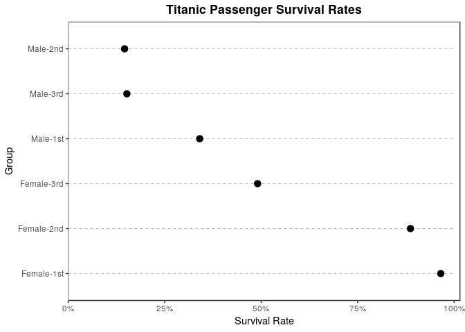
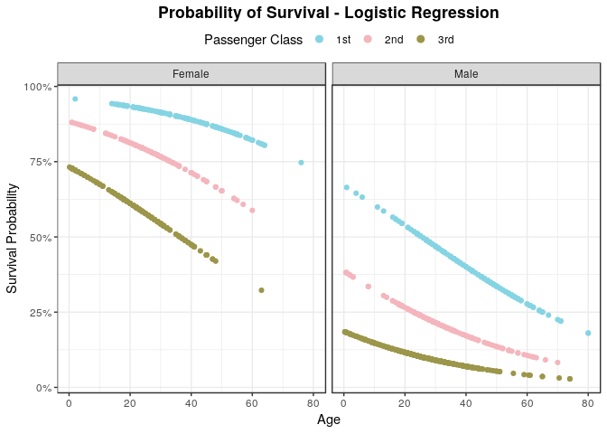
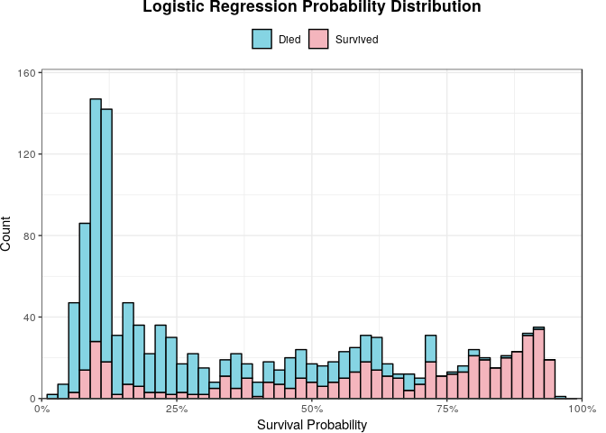
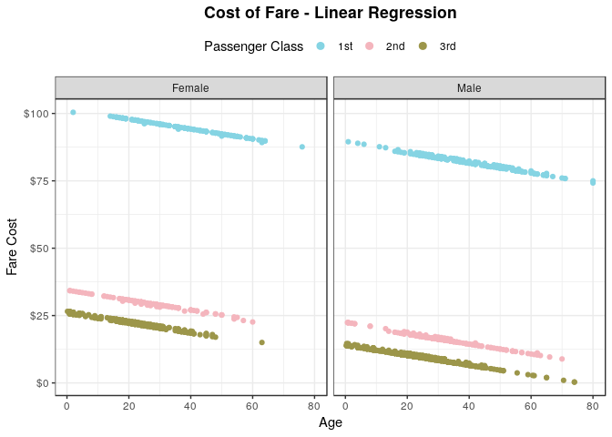
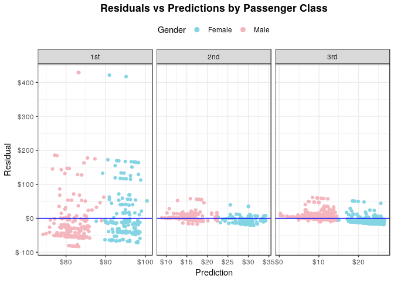
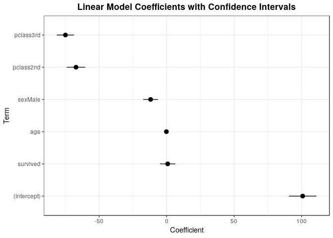

Modeling the Titanic Dataset
================
Jesse Cambon
21 August, 2018

-   [Exploratory Analysis](#exploratory-analysis)
-   [Imputation](#imputation)
-   [Logistic Regression Model](#logistic-regression-model)
-   [Linear Regression Model](#linear-regression-model)

A modeling analysis of the titanic dataset using linear and logistic regression.

To add: imputation, log-binomial model (risk ratio)

References: <https://stats.idre.ucla.edu/r/dae/logit-regression/>

``` r
library(PASWR) #titanic3 dataset
library(MASS) # confint for glm
library(wesanderson) # color palettes
library(formattable) # percent format
library(caret) # regression utilities
library(Hmisc) # capitalize function
library(broom) # model display capabilities
#library(xtable) # pretty table
library(knitr)  
library(kableExtra)
library(tidyverse)
library(rms)

titanic <- titanic3 %>% as_tibble()

titanic_summ <- titanic %>%
  count(survived,pclass,sex) %>%
  mutate(sex=capitalize(as.character(sex))) %>%
  group_by(pclass,sex) %>%
  mutate(perc_surv_num=n/sum(n),
    perc_surv_char=as.character(percent(n/sum(n),0))) %>%
  ungroup() %>%
  mutate(survived=factor(survived,labels=c('Died','Survived')))

# Set default ggplot theme
theme_set(theme_bw()+
  theme(legend.position = "top",
            plot.subtitle= element_text(face="bold",hjust=0.5),
            plot.title = element_text(lineheight=1, face="bold",hjust = 0.5)))
```

Exploratory Analysis
--------------------

``` r
titanic_summ_dot <- titanic_summ %>%
  filter(survived=="Survived") %>%
  mutate(group=str_c(sex,'-',pclass))
  
# Analyze where age is missing
titanic_miss <- titanic %>% select(pclass,sex,age,survived) %>%
  mutate(sex=capitalize(as.character(sex)),missing_age=is.na(age)) %>%
  group_by(pclass,sex) %>%
  dplyr::summarize(perc_missing=mean(missing_age)) %>%
  mutate(group=str_c(sex,'-',pclass))
  

ggplot(titanic_summ_dot, aes(x=reorder(group,-perc_surv_num), y=perc_surv_num)) + 
  geom_point(size=3,color='black') +   # Draw points
  theme(legend.position='none',
        panel.grid=element_blank()) +
  scale_y_continuous(expand=c(0,0,0.015,0),labels=scales::percent) +
  geom_segment(aes(x=group,
                   xend=group,
                   y=min(0),
                   yend=max(1)),
               linetype="dashed", color='black',
               size=0.1) +   # Draw dashed lines
  labs(title="Titanic Passenger Survival Rates") +  
  coord_flip() +
  xlab('Group') +
  ylab('Survival Rate') 
```



``` r
ggplot(data=titanic_summ,
       aes(x = fct_rev(pclass), y=perc_surv_num,fill = survived)) +
facet_grid(~factor(sex)) +
geom_bar(stat='identity',color='black') +
coord_flip() +
  geom_text(data=titanic_summ,aes(label = ifelse(perc_surv_num > 0.07 ,perc_surv_char,NA)),
    size = 3,position = position_stack(vjust = 0.5)) +
scale_fill_manual(values=wes_palette('FantasticFox1')[c(3,4)]) +
theme(axis.text.x=element_blank(),
        axis.ticks.x=element_blank(),
      panel.grid = element_blank())+
labs(title='Passenger Survival Rates by Gender and Class') +
xlab('Passenger Class') +
ylab('') +
guides(fill = guide_legend(title='',reverse=T)) # reverse legend order
```


``` r
ggplot(titanic_miss, aes(x=reorder(group,-perc_missing), y=perc_missing)) + 
  geom_point(size=3,color='black') +   # Draw points
  theme(legend.position='none',
        panel.grid=element_blank()) +
  scale_y_continuous(labels=scales::percent) +
  geom_segment(aes(x=group,
                   xend=group,
                   y=min(perc_missing),
                   yend=max(perc_missing)),
               linetype="dashed", color='black',
               size=0.1) +   # Draw dashed lines
  labs(title="Which Passengers Have Missing Age") +  
  coord_flip() +
  xlab('Group') +
  ylab('Percent Missing Age') 
```


Imputation
----------

<https://www.analyticsvidhya.com/blog/2016/03/tutorial-powerful-packages-imputing-missing-values/> <https://www.andrew.cmu.edu/user/aurorat/MIA_r.html> <http://www.gerkovink.com/miceVignettes/Convergence_pooling/Convergence_and_pooling.html>

``` r
library(mice)
```

    ## 
    ## Attaching package: 'mice'

    ## The following object is masked from 'package:tidyr':
    ## 
    ##     complete

    ## The following objects are masked from 'package:base':
    ## 
    ##     cbind, rbind

``` r
# Use mice to impute data - takes a few seconds on my laptop
titanic_imputed <- mice(titanic %>% select(pclass,age,sex), m=10, maxit = 50, method = 'pmm', seed = 3530,printFlag=F)

imp_with <- with(titanic_imputed, lm(age ~ pclass + sex))

pooled <- pool(imp_with)

# check the fit
summary(pooled)
```

    ##               estimate std.error  statistic       df      p.value
    ## (Intercept)  37.023647 0.8928789  41.465473 318.0088 0.000000e+00
    ## pclass2nd    -9.855947 1.1234681  -8.772787 405.7172 0.000000e+00
    ## pclass3rd   -14.945784 0.9483567 -15.759665 268.3844 0.000000e+00
    ## sexmale       3.843549 0.8355924   4.599789 187.5426 5.660992e-06

``` r
# Add imputed Data
titanic_imp <- complete(titanic_imputed,10) %>%
  bind_cols(titanic %>% select(age,survived) %>% rename(age_orig=age)) %>%
  mutate(imputed=case_when(is.na(age_orig) ~ 'Imputed', TRUE ~ 'Original'))


# Plot

ggplot(data=titanic_imp) +
 geom_density(aes(x=age,color=imputed), alpha=0.8) + 
  #facet_grid(vars(sex),vars(pclass)) +
  theme(legend.position='top') +
    labs(title="Distributions of Original v. Imputed Age") +
  guides(color=guide_legend(title=''))
```


``` r
ggplot(data=titanic_imp) +
 geom_density(aes(x=age,color=imputed), alpha=0.8) + 
  facet_grid(vars(sex),vars(pclass)) +
  theme(legend.position='top') +
    labs(title="Distributions of Original v. Imputed Age") +
  guides(color=guide_legend(title=''))
```


``` r
# titanic_imp <- titanic %>%
  # select(survived,sex,pclass,age) %>%
# titanic_imputed <- impute.transcan(impute_arg, imputation=1, data=iris.mis, list.out=TRUE,pr=FALSE, check=FALSE) 


# imp_obj <- aregImpute(~age + pclass + sex, data = titanic, n.impute = 5)
# 
# titanic_imp <- titanic %>%
#   mutate(imputed_age=imp_obj$imputed$age)


# Imputate with k nearest neighbors method
# imp_model <- preProcess(titanic %>% select(pclass,survived,sex,age), method = c("knnImpute"))
# library(RANN) # nearest neighbors library
# titanic_imputed <- predict(imp_model,titanic %>% select(pclass,survived,sex,age))
```

Logistic Regression Model
-------------------------

We will use the brier score as one measurement of accuracy for our model: <https://en.wikipedia.org/wiki/Brier_score> The book 'Superforecasting' by Philip Tetlock has a good discussion of the use of brier scores.

``` r
log_fit <- glm(survived ~ sex + pclass + age ,family=binomial(link="logit"),data=titanic)

predictions <- titanic %>%
  dplyr::select(sex,pclass,age,survived) %>%
  mutate(prediction=predict(log_fit,newdata=titanic,type='response')) %>%
  mutate(prediction_binary=case_when(prediction >0.5 ~ 1, TRUE ~ 0),
         brier_score=abs(prediction-survived))

#summary(fit)

log_confint <- confint(log_fit) %>% tidy()
```

    ## Waiting for profiling to be done...

``` r
colnames(log_confint) <- c('Term','LCLM','UCLM')

log_info <- glance(log_fit) %>% 
  mutate(meanBrierScore=mean(predictions$brier_score,na.rm=T)) %>%
  dplyr::select(meanBrierScore,everything())

log_terms <- tidy(log_fit) %>% rename(Coefficient=estimate,Term=term) %>%
   # Order by largest coefficient but put intercept term on bottom
  arrange(Term=='(Intercept)',desc(Coefficient)) %>%
  left_join(log_confint,by='Term') %>%
  dplyr::select(Term,Coefficient,LCLM,UCLM,everything())

# An analysis of our model's classification accuracy
confusionMatrix(factor(predictions$prediction_binary), factor(predictions$survived))
```

    ## Confusion Matrix and Statistics
    ## 
    ##           Reference
    ## Prediction   0   1
    ##          0 710 199
    ##          1  99 301
    ##                                           
    ##                Accuracy : 0.7723          
    ##                  95% CI : (0.7487, 0.7948)
    ##     No Information Rate : 0.618           
    ##     P-Value [Acc > NIR] : < 2.2e-16       
    ##                                           
    ##                   Kappa : 0.4987          
    ##  Mcnemar's Test P-Value : 9.756e-09       
    ##                                           
    ##             Sensitivity : 0.8776          
    ##             Specificity : 0.6020          
    ##          Pos Pred Value : 0.7811          
    ##          Neg Pred Value : 0.7525          
    ##              Prevalence : 0.6180          
    ##          Detection Rate : 0.5424          
    ##    Detection Prevalence : 0.6944          
    ##       Balanced Accuracy : 0.7398          
    ##                                           
    ##        'Positive' Class : 0               
    ## 

``` r
ggplot(data=predictions %>% mutate(sex=capitalize(as.character(sex))),
          aes(x = age, y = prediction, color = pclass)) +
geom_point() +
facet_grid(~factor(sex)) +
scale_y_continuous(labels=scales::percent) +
theme(legend.margin=margin(0,0,0,0)) +
scale_color_manual(values=wes_palette('Moonrise3')) +
labs(title='Probability of Survival - Logistic Regression') +
xlab('Age') +
ylab('Survival Probability') +
guides(color = guide_legend(title='Passenger Class',reverse=F,override.aes = list(size=2.5))) 
```

    ## Warning: Removed 263 rows containing missing values (geom_point).



``` r
ggplot(predictions, aes(prediction))+
  geom_histogram(binwidth=0.02,aes(fill=factor(survived,labels=c('Died','Survived'))),
    col='black') + 
  # prevent right label on axis from being clipped
  theme(legend.pos='top',plot.margin=margin(r = 20, unit = "pt")  ) +
  scale_fill_manual(values=wes_palette('Moonrise3')) +
  scale_x_continuous(labels=scales::percent,
                     limits=c(0,1),
                     expand=c(0,0)) + # eliminate left/right margin
    scale_y_continuous(expand=c(0,0,0.07,0)) + # 7% margin on top
  labs(title="Logistic Regression Probability Distribution") +
xlab('Survival Probability') +
ylab('Count') +
guides(fill = guide_legend(title='')) 
```

    ## Warning: Removed 263 rows containing non-finite values (stat_bin).



``` r
# Same graph as prior but faceted on class

ggplot(predictions, aes(prediction))+
  geom_histogram(binwidth=0.05,aes(fill=factor(survived,labels=c('Died','Survived'))),
    col='black') + 
  facet_wrap(~pclass,scales='free_y') +
  theme(legend.pos='top',
        # prevent right label on axis from being clipped
        plot.margin=margin(r = 20, unit = "pt")
        ) +
  scale_fill_manual(values=wes_palette('Moonrise3')) +
  scale_x_continuous(labels=scales::percent, limits=c(0,1),
                     expand=c(0,0) # eliminate left/right margin
                     ) +
    scale_y_continuous(expand=c(0,0,0.07,0)) + # 7% margin on top
  labs(title="Logistic Regression Probability Distribution by Passenger Class") +
xlab('Survival Probability') +
ylab('Count') +
guides(fill = guide_legend(title='')) 
```

    ## Warning: Removed 263 rows containing non-finite values (stat_bin).


``` r
ggplot(predictions, aes(brier_score)) +
  geom_histogram(binwidth=0.02,aes(fill=factor(survived,labels=c('Died','Survived'))),
                 col='black') +
  labs(title="Brier Score Distribution") +
    scale_fill_manual(values=wes_palette('Moonrise3')) +
  # Use expand to make sure right axis label isn't clipped
    scale_x_continuous(expand=c(0,0,0.01,0),limits=c(0,1)) +
    scale_y_continuous(expand=c(0,0,0.07,0)) + # 7% margin on top
xlab('Brier Score') +
ylab('Count') +
guides(fill = guide_legend(title='')) 
```

    ## Warning: Removed 263 rows containing non-finite values (stat_bin).


``` r
kable(log_info %>% 
        dplyr::select(-df.residual,-df.null,-deviance),format='markdown',digits=2) %>%
  kable_styling(bootstrap_options = c("striped",'border'))
```

|  meanBrierScore|  null.deviance|   logLik|     AIC|      BIC|
|---------------:|--------------:|--------:|-------:|--------:|
|             0.3|        1414.62|  -491.23|  992.45|  1017.22|

``` r
kable(log_terms,format='markdown',digits = 2) %>%
  kable_styling(bootstrap_options = c("striped",'border'))
```

| Term        |  Coefficient|   LCLM|   UCLM|  std.error|  statistic|  p.value|
|:------------|------------:|------:|------:|----------:|----------:|--------:|
| age         |        -0.03|  -0.05|  -0.02|       0.01|      -5.43|        0|
| pclass2nd   |        -1.28|  -1.73|  -0.84|       0.23|      -5.68|        0|
| pclass3rd   |        -2.29|  -2.74|  -1.85|       0.23|     -10.14|        0|
| sexmale     |        -2.50|  -2.83|  -2.18|       0.17|     -15.04|        0|
| (Intercept) |         3.52|   2.90|   4.18|       0.33|      10.78|        0|

Linear Regression Model
-----------------------

A linear model of passenger fare cost.

``` r
lm_fit <- lm(fare ~ sex + pclass + age + survived,data=titanic)

# Calculate confidence limit
lm_confint <- confint(lm_fit) %>% tidy()
colnames(lm_confint) <- c('Term','LCLM','UCLM')

lm_predictions <- titanic %>%
  dplyr::select(sex,pclass,age,survived,fare) %>%
  mutate(prediction=predict(lm_fit,newdata=titanic)) %>%
  mutate(residual=fare-prediction)

lm_info <- glance(lm_fit)

lm_terms <- tidy(lm_fit) %>%
  rename(Term=term,Coefficient=estimate) %>%
  left_join(lm_confint,by='Term' ) %>%
  dplyr::select(Term,Coefficient,LCLM,UCLM,everything())

#summary(lm_fit)

# Histogram of Residuals
ggplot(lm_predictions, aes(residual)) +
  geom_histogram(bins=30) +
facet_grid(~pclass,scales='free_x') +
geom_vline(xintercept=0,color='red',size=0.4) +
scale_x_continuous(labels=scales::dollar ,expand=c(0,0,0,0)
                   ) +
scale_y_continuous(expand=c(0,0,0.07,0)) +  
  labs(title="Residual Distribution by Passenger Class") +
xlab('Residual') +
ylab('Count') 
```

    ## Warning: Removed 264 rows containing non-finite values (stat_bin).


``` r
ggplot(data=lm_predictions %>% mutate(sex=capitalize(as.character(sex))),
          aes(x = age, y = prediction, color = pclass,group=1)) +
geom_point() +
facet_grid(~factor(sex)) +
scale_y_continuous(labels=scales::dollar) +
#theme(legend.margin=margin(0,0,0,0)) +
scale_color_manual(values=wes_palette('Moonrise3')) +
labs(title='Cost of Fare - Linear Regression') +
xlab('Age') +
ylab('Fare Cost') +
guides(color = guide_legend(title='Passenger Class',reverse=F,override.aes = list(size=2.5))) 
```

    ## Warning: Removed 263 rows containing missing values (geom_point).



``` r
ggplot(data=lm_predictions %>% mutate(sex=capitalize(as.character(sex))),
          aes(x = prediction, y = residual, color = sex)) +
geom_point() +
facet_grid(~pclass,scales='free_x') +
geom_hline(yintercept=0) + # horizontal line at 0 residual
#geom_smooth(method="lm",show.legend=F,size=0.5) +
scale_x_continuous(labels=scales::dollar) +
scale_y_continuous(labels=scales::dollar) +
#theme(legend.pos='none') +
scale_color_manual(values=wes_palette('Moonrise3')) +
labs(title='Residuals vs Predictions by Passenger Class') +
xlab('Prediction') +
ylab('Residual') + 
guides(color = guide_legend(title='Gender',reverse=F,override.aes = list(size=2.5))) 
```

    ## Warning: Removed 264 rows containing missing values (geom_point).



``` r
ggplot(data=lm_predictions %>% mutate(sex=capitalize(as.character(sex))),
          aes(x = age, y = residual, color = sex)) +
geom_point() +
facet_grid(~pclass) +
  geom_hline(slope=0,yintercept=0) + # horizontal line at 0 residual
scale_y_continuous(labels=scales::dollar) +
theme(legend.margin=margin(0,0,0,0)) +
scale_color_manual(values=wes_palette('Moonrise3')) +
labs(title='Residuals By Passenger Class') +
xlab('Age') +
ylab('Residual') +
guides(color = guide_legend(title='Gender',reverse=F,override.aes = list(size=2.5))) 
```

    ## Warning: Ignoring unknown parameters: slope

    ## Warning: Removed 264 rows containing missing values (geom_point).


``` r
ggplot(data=lm_terms,
          aes(x = reorder(Term,-Coefficient), y = Coefficient)) +
geom_point() +
coord_flip() +
geom_pointrange(mapping=aes(ymin=LCLM, ymax=UCLM)) + 
scale_color_manual(values=wes_palette('Moonrise3')) +
labs(title='Linear Model Coefficients with Confidence Intervals') +
xlab('Term')
```



``` r
kable((lm_info %>% dplyr::select(-df.residual,-logLik,-deviance)),format='markdown',digits = 2) %>%
  kable_styling(bootstrap_options = c("striped",'border'))
```

|  r.squared|  adj.r.squared|  sigma|  statistic|  p.value|   df|       AIC|       BIC|
|----------:|--------------:|------:|----------:|--------:|----:|---------:|---------:|
|       0.39|           0.39|  43.59|      133.6|        0|    6|  10862.73|  10897.39|

``` r
kable(lm_terms,format='markdown',digits = c(1,1,1,1,2,2,2)) %>%
  kable_styling(bootstrap_options = c("striped",'border'))
```

| Term        |  Coefficient|   LCLM|   UCLM|  std.error|  statistic|  p.value|
|:------------|------------:|------:|------:|----------:|----------:|--------:|
| (Intercept) |        108.6|   96.4|  120.8|       6.21|      17.50|     0.00|
| sexmale     |        -11.5|  -18.0|   -5.0|       3.31|      -3.46|     0.00|
| pclass2nd   |        -72.0|  -79.8|  -64.3|       3.95|     -18.23|     0.00|
| pclass3rd   |        -81.2|  -88.7|  -73.6|       3.85|     -21.11|     0.00|
| age         |         -0.3|   -0.5|   -0.1|       0.11|      -2.57|     0.01|
| survived    |          0.6|   -6.2|    7.3|       3.45|       0.17|     0.87|
